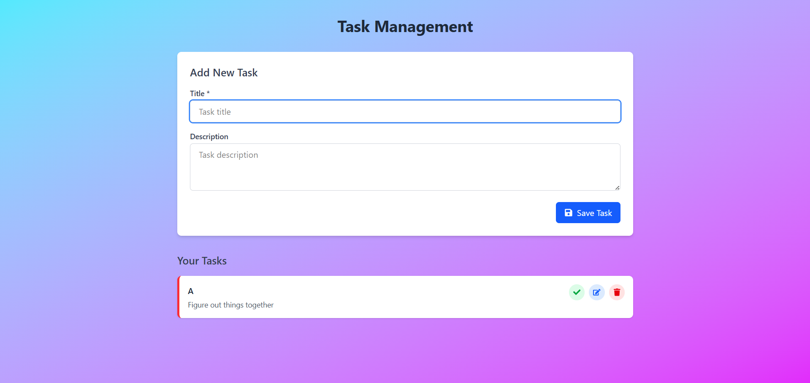
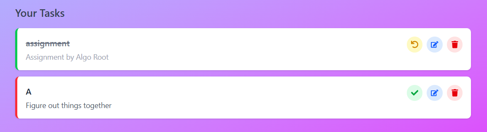

# 📝 Task Management Application


A full-stack task management system with a Next.js frontend, Node.js/Express backend, and MongoDB database.

## 🚀 Quick Start

### 🔹 1. Clone the repository
```bash
git clone https://github.com/yourusername/task-management-app.git
cd task-management-app
```

### 🔹 2. Set up backend ⚙️
```bash
cd backend
npm install
echo "MONGO_URI=mongodb://localhost:27017/taskmanager" > .env
echo "PORT=5000" >> .env
npm run dev
```

### 🔹 3. Set up frontend 🎨 (in new terminal)
```bash
cd ../frontend
npm install
npm run dev
```

## 🔧 Manual Setup 🛠️

### 🖥️ Backend Installation
```bash
# Navigate to backend folder
cd backend

# Install dependencies 📦
npm install express mongoose cors dotenv

# Create environment file 📜
cat > .env <<EOF
MONGO_URI=mongodb://localhost:27017/taskmanager
PORT=5000
EOF

# Start development server 🚀
npm run dev
```

### 🎨 Frontend Installation
```bash
# Navigate to frontend folder
cd frontend

# Install dependencies 📦
npm install axios react-icons

# Install dev dependencies 🛠️
npm install -D tailwindcss postcss autoprefixer

# Initialize Tailwind CSS 🎨
npx tailwindcss init -p

# Start development server 🚀
npm run dev
```

## 📚 API Reference 🌐

### 🔗 Base URL
```
http://localhost:5000/api
```

### 🔹 Endpoints 📌

#### 📥 Get all tasks
```bash
curl -X GET http://localhost:5000/api/tasks
```

#### ➕ Create a task
```bash
curl -X POST -H "Content-Type: application/json" -d '{"title":"My Task"}' http://localhost:5000/api/tasks
```

#### ✅ Update a task
```bash
curl -X PATCH -H "Content-Type: application/json" -d '{"completed":true}' http://localhost:5000/api/tasks/12345
```

#### ❌ Delete a task
```bash
curl -X DELETE http://localhost:5000/api/tasks/12345
```

## 🖼️ Screenshots 📸

| 🖥️ Desktop View | 

 



## 📝 License 📄
MIT

